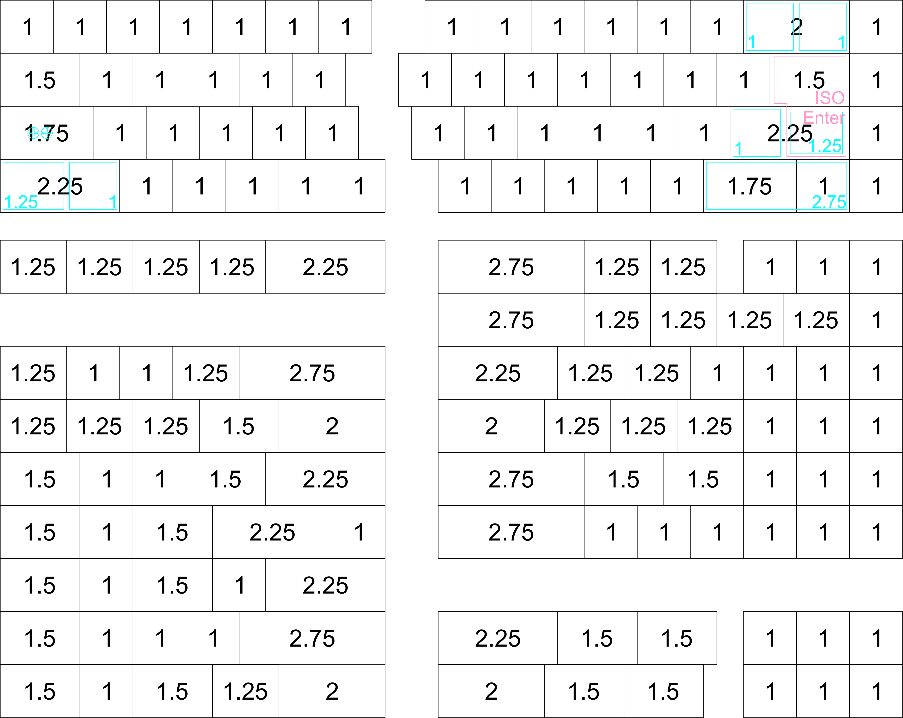

# TS65 - AVR Based
The Split 65% Keyboard - AVR Based

This is a custom 65% style keyboard that is split in the middle to provide a more ergonomic option whilst not being drastically different from the standard stagger used on keyboards

#Features
- Open Source Design
- Fully Programmable Keys
- Split design for better ergonomics, while maintaining the currently "standard" keyboard layput
- PCBs and case designed so that the two sides can be aligned perfectly like a 65%, for others using the board, cleaner desk while not at it, etc.
- Multiple layers
- Alps/Cherry (PCB/Plate) switch support
- PCB mount stabs supported
- Backlight LED on top to maintain compatibility with the few backlit keysets out there
- 3 Indicator + CapsLock LED
- 18 SMD RGB LEDs on the bottom of the PCB for under/side glow
- SMD (SOD-123) diodes
- Individual resistors for the LEDs not required as it uses a dedicated LED driver
- Using large (0805) capacitors and resistors so it is easier to hand-solder

#Optional Features Supported
- Possibility to add a buzzer
- Possibility to add a PS/2 trackpoint to either halves.
- Possibility to add a rotary dial for changing volume, LED brightness, etc.

#Layout options
- Split backspace
- Split left shift
- ISO support
- Off-center capslock
- 2.75 and 1.75 right shift
- Lots of options for bottom row

In the below image you can see the different options available, the top four rows represent the four rows of th keyboard and the options for the final keyboard row is represented by the remaining rows in the image.

